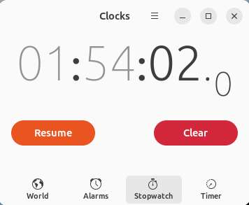

# 🐍 Python Concept: [Re:Day 1 & 2- Functions and Variables Part 1]
  
*This note is written with the help of [StackEdit](stackedit.io) and [EmojiCopy](emojicopy.com)*

**Date:**  April 7th, 2026 - [10:35-13:30]

**Tags:**  `#python`, `#primitive-ai`, `#self-study`, `#cs50_2026`, `#harvard_university` `#edX` `#VSCode`

**Time spent**:  *`1 hours, 54 minutes and 02 seconds`*

**Course infos**: [Course | CS50's Introduction to Programming with Python | edX](https://learning.edx.org/course/course-v1:HarvardX+CS50P+Python/home?audit_mode=)

**Track:** 
- From: [Week 1 - Functions and Variables in Python](https://learning.edx.org/course/course-v1:HarvardX+CS50P+Python/block-v1:HarvardX+CS50P+Python+type@sequential+block@744dad66fcce478a92fb1073b3d373fa/block-v1:HarvardX+CS50P+Python+type@vertical+block@50897469e09545f29c4535c6ffb2c704)
- To: [Week 1 - Shorts](https://learning.edx.org/course/course-v1:HarvardX+CS50P+Python/block-v1:HarvardX+CS50P+Python+type@sequential+block@744dad66fcce478a92fb1073b3d373fa/block-v1:HarvardX+CS50P+Python+type@vertical+block@085ac859b4024776ae5a5c49d9ba6dc9)
## 🎯 Objective

* This is the resetting note to start over again due to procrastinating, laziness and lack of focus.
* Today goal is to remember and write down your own what you have learnt at Day 01 & Day 02.
  
## 📝 Core Notes

- **1. Functions**
> Basically, very function has its own meaning and action, remember to keep the function simple as long as it only serves one purpose.
> You can nest functions inside a function.

* There is 2 types of function in Python and also in mostly other programming languages.

||Built-in function |User-defined function|
|-----|----|----|
|**Definition**|Pre-build functions/ & `methods()` that have been declared by Python itself or others libraries.| Declared and defined by user to serve developer's purpose.|
|**Syntax**|`print()`,`split()`, etc.|Declare a user-defined function by using `def functionName(param):` in Python|

*Note that: When define/ declare a function with a block of code, it's inclined by Tab key under that function instead of  `curly bracket - {}` like in C/C++, Java, JavaScript, etc.*
**Syntax when declare a user-defined function**
```py
def userDefinedFunction([param]):
	#-->Tab in:
	block of code
	#Code inside this tab will serve as curly bracket like in other programming langugaes.
#-->Tab out
```

- **2. Arguments and Parameters**
> When declaring/ working with functions, you will(or not)  need to adding/ defining some inputs/ values so that the functions can use it to act, there will be something called arguments or parameters based on the situation you are using those terms.

- ***Arguments and Paramenters*** are general terms/ definitions in programming itself. It's likely have the same meaning but it's mostly use based on the situation.
***Arguments vs Paramenters***

||*Arguments*|*Parameters*|
|-----|----|----|
|**Definition**|It's the `value` that user need to pass inside a function| The variables/ values that the functions need (or not) in order to make the function working |
|**Syntax**|Passing value/ variable inside the function `function(value, or, variables)` and its separator by `comma`| Adding parameters into a function when define `def funtion(param1, param2,paramN):`|

*Note that: You can also add default value for its parameters using `=` when the user is not passing the argument for the function.*
**Syntax**
```py
def myFunction(param="Nothing"):
	print('You are passing the arguments:', param);

myFunction("Hello");
# The result will be 'You are passing the arguments: Hello
myFunction();
# The result will be 'You are passing the arguments: Nothing
# It only worked when you adding default value of its parameter. 

def noDefaultValue(param):
	print(param);
# If the parameter doesn't have the default value it won't work and it will have error
noDefaultValue();
# Result will be error
noDefaultValue('Gei');
# Result will be 'Gei'
```

- **3. Variables**
> Variables are what you will use the most when programming so pay more attention to its documentation, attribute and etc.

- Variables is what you gonna need to **store** value when programming.
- It can be seen most likely everywhere in Python, from `parameters, arugments, return values`, etc.
**Declaration**
```python
x = 'Hello' # Declaring variable `x` to store 'Hello' value so you could reuse it as arguments(to pass value inside a function) or working with it.

xFunction(x); # Passing the stored value of x's for the xFucntion to work.
```

**Declaring variable `x`  as a parameters in a function so the function could working with it**
```py
def xFunction(x):
	return x; # Return value of its function for others to work or store.
```
**Declaring `y` to store/ get the return value from the `xFunction(x)`;
```py
y = xFunction(x); 
```

## ⏱️ Stopwatch Images



## 📋🎗️ Reminder/ To-do Task

- Learn to read the documentation.

#### Learning resources:
[Python Documents](https://docs.python.org)
#### Other resources:
***Extensions usage:***
- LiveServer on VSCode
- Page Ruler on Browser
* This note is written with the help of [StackEdit](stackedit.io) and [EmojiCopy](emojicopy.com)