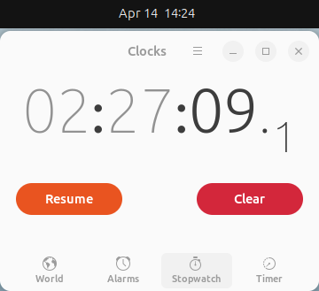

# 🐍 Python Concept: [Day 3 - Week 1: Conditionals]

*This note is written with the help of [StackEdit](stackedit.io) and [EmojiCopy](emojicopy.com)*

**Date:** April 14th, 2026 - [9:30-14:00] &

**Tags:**  `#python`, `#primitive-ai`, `#self-study`, `#cs50_2026`, `#harvard_university`  `#edX`  `#VSCode`

**Time spent**: *` hours,  minutes and  seconds`*

**Course infos**: [Course | CS50's Introduction to Programming with Python | edX](https://learning.edx.org/course/course-v1:HarvardX+CS50P+Python/home?audit_mode=)

**Track:**

- From: [Week 1 - Conditionals](https://learning.edx.org/course/course-v1:HarvardX+CS50P+Python/block-v1:HarvardX+CS50P+Python+type@sequential+block@d25e27c90c304b0293d1f8dbda47c1b6/block-v1:HarvardX+CS50P+Python+type@vertical+block@30350cbeec734204b98c3f2d7e798c40)

- To: [Week 1 - Shorts](https://learning.edx.org/course/course-v1:HarvardX+CS50P+Python/block-v1:HarvardX+CS50P+Python+type@sequential+block@d25e27c90c304b0293d1f8dbda47c1b6/block-v1:HarvardX+CS50P+Python+type@vertical+block@140e208a5c094c219462f778ebb7ab8a)

## 🎯 Objective

* Get used to with conditionals in Python

## 📝 Core Notes

-  **1. Conditionals**
- ***Conditionals, or conditional statements, in Python and other languages are the ability to ask questions and answer those questions (usually True - False aka Boolean expression) using `if` or `match case` (also known as `switch case`.*** 
**Syntax**
```python
if term: #[should use logical operators or comparison operators to ask the question]
...
```
*Note that: When using a `if` or `match` statements remember always to indent to connote the blocks of its code - it worked the same way when you define a function and others. It's worked as `curly bracket - {}`*
-  **2. `if` statement**
```python
if (x>y):
	print("x is larger than y");
if (x<y):
	print("x is smaller than y");
if (x==y):
	print("x is equal to y");
```


**`elif`**
```python
if (x>y):
	print("x is larger than y.");
elif(x<y):
	print("x is smaller than y.");
elif(x==y):
	print("x is equal to y.");
```

**`else`**
```python
if (x>y):
	print("x is larger than y.");
elif(x<y):
	print("x is smaller than y.");
else:
	print("x is equal to y.");
```

**Improved logically**


-  **3. `match` - the`switch case` statement**
	- Structural pattern matching aka `switch-case` statement
**Syntax**
```python
match (term): #parentheses is optional
	case parttern-1:
		#[do something for pattern 1]
	case pattern-2:
		#[do something for pattern 2]
	case pattern-n:
		#[do something for pattern n]
	case _:
		#[default value if the term doesn't any of these pattern]
```
-  **4. Operators (Part 2)**
-  **4.1 Arithmetic Operators**
 [Operators(Part 1)]
 - **4.2 Assignment Operators**
-  **4.3 Comparison (Relational) Operators**
-  **4.4 Conditional (Ternary) Operators**
-  **4.5 Logical Operators**
-  **5. Build your own function**
-  **6. `bool` - Boolean expression**
- Just a True/ False
-  **8. Pythonic** 	


## Bonus, notes and teacher/ audience's questions:
**1. What if I just using if at all the case when writing `if` statement?**
>
**2. Are there is any other way that could make thing simpler when using an `if` statement?**
>
**3. What is the meaning of an even or odd numbers?"
||**Even Numbers** |**Odd Numbers** |
|---|---|---|
|***Definition***|||
|***Code***|||
 
 **4. In Java, C or C++, etc.  instead of passing the argument, we can ALSO the ADDRESS of the variables. So in Python can we do that?**
>
**5. Can we use `dot` operator on the user-defined function like when we calling the `method()` on the built-in function like `str.split()`?**
>

## New Major Keywords
proverbial(adj)
coarser approach
connote blocks
parity
## ⏱️ Stopwatch Images

**First session ended at 14:24**



**Second session ended at 18:35**


  

## 📋🎗️ Reminder/ To-do Task
- Adding Problem Set 1.md for Week 1 - Conditionals.
- Fully updating the note.

#### Learning resources:

[Python Documents](https://docs.python.org)

#### Other resources:

***Extensions usage:***

- LiveServer on VSCode

- Page Ruler on Browser

* This note is written with the help of [StackEdit](stackedit.io) and [EmojiCopy](emojicopy.com)